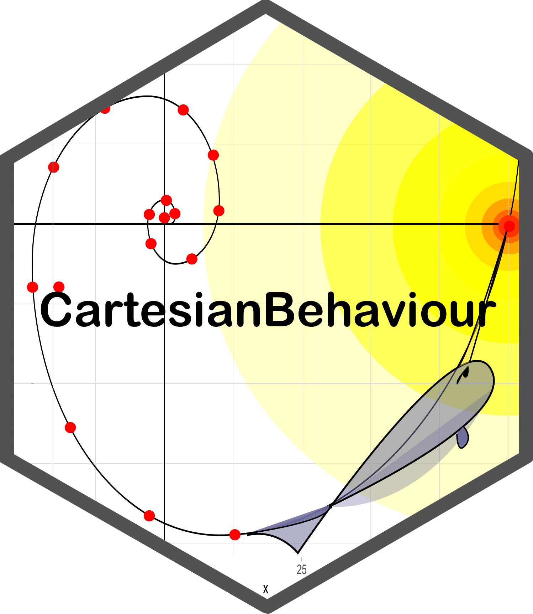

# CartesianBehaviour 

## CartesianBehaviour
<br>
This project seeks to simplify the conversion of Cartesian data provided from any source into behavioral endpoints. It get inspired by the packages <a href="https://swarm-lab.github.io/trackR/">TrackR</a> and <a href="https://github.com/JimMcL/trajr">trajr</a>, check them for options of tracking already implemented.

Instalation
```
require(devtools)
install_github("Faccco/CartesianBehaviour")

# OR

require(githubinstall)
githubinstall("CartesianBehaviour")
```
