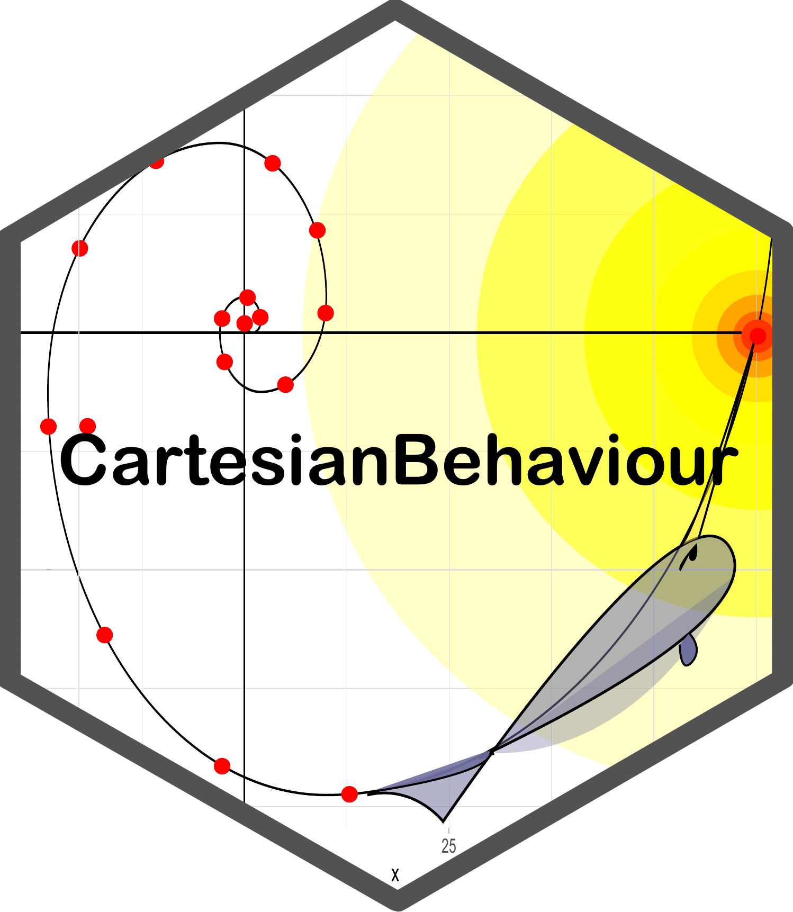

# CartesianBehaviour - Points to behaviour 
[](https://github.com/Faccco/CartesianBehaviour/actions/workflows/R-CMD-check.yaml)


[](<http://dx.doi.org/10.2139/ssrn.5123233>)

## Description
This project seeks to simplify the conversion of Cartesian tabular data provided from any source into behavioral endpoints. It get inspired by the packages <a href="https://swarm-lab.github.io/trackR/">TrackR</a> and <a href="https://github.com/JimMcL/trajr">trajr</a>, check them for options of tracking already implemented.
The staring point was to measure zebrafish (_Danio rerio_) behavior within zones of interest.
Future updates aim to:
 - Process data without zones (Speed improvement) [SHORT TERM]
 - Implement a shiny app [MEDIUM TERM]
 - Integrate with a proper tracking app [LONG TERM]
 
 For those interested in another better in some way or another solutions we tested and recommend
  
  For tracking:<br>
  - [DeepLabCut](https://github.com/DeepLabCut/DeepLabCut) (Neural network based)<br>
  - [TrackR](https://swarm-lab.github.io/trackR/) (Package who inspired this project)<br><br>
  For evaluation:<br>
  - [trajr](https://github.com/JimMcL/trajr) (Some functions are borrowed from this one)<br>
  - [MoveR](https://github.com/qpetitjean/MoveR)<br>
  - [celltrackR](https://github.com/ingewortel/celltrackR)<br><br>
  For both:<br>
  - [ToxTrac](https://sourceforge.net/projects/toxtrac/)<br>
  - [AnimalTA](http://vchiara.eu/index.php/animalta)<br>
  

## Instalation
```
library(devtools)
install_github("Faccco/CartesianBehaviour")

# OR

library(githubinstall)
githubinstall("CartesianBehaviour")
```

## Basic use

For those not used to R here is a basic workflow to get your data.
Note that to run CartesianBehaviour you do not need to install the packages bellow, but they make dealing with .csv, .xls and .txt files easier.
Also, be sure to install CartesianBehaviour prior to the analysis.

```
# Install and load required packages for analysis

## List of required packages
package.list <- c("devtools",  # Development tools for GitHub installations
                  "data.table", # Efficient data manipulation
                  "readxl",    # Excel file handling
                  "tools")     # File path operations


## Identify packages needing installation
new.packages <- package.list[!(package.list %in% installed.packages()[,"Package"])]

## Install missing packages
if(length(new.packages)) {
  message("Installing required packages: ", paste(new.packages, collapse = ", "))
  install.packages(new.packages)
}

## Load all packages (silently)
invisible(lapply(package.list, require, character.only = TRUE))

## Cleanup installation variables
rm(package.list, new.packages)

```

When working with tracking software they usually export the tracks in csv, txt or xml format. Place all files in one folder and change the folder path with the folder you crated.

### .csv

```
# Set path to data directory
folder_path <- "D:/Path/Of/The/Files"  # Replace with actual data directory path

# Set the column names for the
X_axis <- "x_cm"
Y_axis <- "y_cm"
Time <- "frame"

# Get list of CSV files in directory
csv_list <- list.files(folder_path, pattern = "\\.csv$", full.names = FALSE)

# Load files with automatic delimiter detection
for (file in csv_list) {
  file_path <- file.path(folder_path, file)

  ## First attempt with comma separator
  data <- read.csv(file_path,
                   sep = ",",
                   header = TRUE,
                   stringsAsFactors = FALSE)

  ## Fallback to semicolon if single column detected (common European CSV format)
  if (ncol(data) == 1) {
    data <- read.csv(file_path,
                     sep = ";",
                     header = TRUE,
                     stringsAsFactors = FALSE)
  }

  ## Create dataframe using filename (without .csv extension)
  assign(gsub(".csv$", "", file), data)
}

# Cleanup temporary objects
rm(data, file, file_path, folder_path, csv_list)

# Combine all loaded datasets into a single list
Dados <- mget(setdiff(ls(), c("Time", "X_axis", "Y_axis")))

# Standardize column names across all datasets (time, x, y coordinates)
for(i in seq_along(Dados)){
  Dados[[i]] <- Dados[[i]][, colnames(Dados[[i]]) %in% c(Time, X_axis, Y_axis)]
  colnames(Dados[[i]]) <- c("time", "x", "y")  # Ensure consistent naming convention
}

# Environment Cleanup
rm(list = setdiff(ls(), "Dados"))
```

### .txt

```
# Set path to data directory (update with actual path)
folder_path <- "D:/Path/Of/The/Files" # Replace with actual data directory path

# Identify all .txt files in directory
txt_files <- list.files(folder_path, pattern = "\\.txt$", full.names = FALSE)

# Load and process tab-delimited text files
for (file in txt_files) {
  file_path <- file.path(folder_path, file)

  ## Efficiently read tab-separated files using data.table's fread
  data <- data.table::fread(file_path, sep = "\t", encoding = "UTF-8")

  ## Create dataframe using filename (without .txt extension)
  assign(gsub(".txt$", "", file), data)
}

# Cleanup temporary objects
rm(data, txt_files, file, file_path, folder_path)

# Combine all loaded datasets into a single list
Dados <- mget(ls())

# Enforce consistent column names across all datasets (time, x, y coordinates)
for(i in seq_along(Dados)){
  colnames(Dados[[i]]) <- c("time", "x", "y")  # Required column format for downstream analysis
}

# Remove all objects except the compiled dataset list
rm(list = setdiff(ls(), "Dados"))
```

### .xml

```
# Set working directory path for data files
folder_path <- "D:/Path/Of/The/Files""D:/Path/Of/The/Files"

# Data loading configuration
single_file <- FALSE  # Are all tracks in one Excel file? TRUE = yes, FALSE = no

if(single_file) {
  ## SINGLE FILE PROCESSING (Multiple sheets)
  
  ## Get Excel file information
  excel_name <- list.files(folder_path, pattern = c("xlsx", "xls"))
  file_path <- file.path(folder_path, excel_name[1])
  sheet_list <- excel_sheets(path = file_path[1])
  
  ## Load data from each worksheet as separate dataframes
  for (sheet in sheet_list) {
    data <- read_excel(file_path, sheet = sheet)
    assign(sub(".xlsx$", "", sheet), data)  # Create dataframe without .xlsx extension
  }
  
  ## Cleanup temporary objects
  rm(data, sheet_list, sheet, file_path, folder_path, excel_name, single_file)
  
} else {
  ## MULTI-FILE PROCESSING
  
  ## Get list of all Excel files in directory
  excel_list <- list.files(folder_path, pattern = c("xlsx", "xls"))
  
  ## Load each file as separate dataframe
  for (file in excel_list) {
    file_path <- file.path(folder_path, file)
    data <- read_excel(file_path)
    assign(sub(".xlsx$", "", file), data)  # Create dataframe from filename
  }
  
  ## Cleanup temporary objects
  rm(data, excel_list, file, file_path, folder_path, single_file)
}

# Combine all loaded objects into a single list
Dados <- mget(ls())

# Standardize column names across all datasets
for(i in 1:length(Dados)){
  colnames(Dados[[i]]) <- c("time", "x", "y")  # Format: [timestamp, x_coord, y_coord]
}

# Final environment cleanup (keep only Dados)
rm(list = setdiff(ls(), "Dados"))
```

### Reescale positions (Optional)

Some software capture the positions in units of measurement that are not useful

```
# Calculate minimum and maximum positional values for each animal
minmaxtrk <- function(list_group, X_axi, Y_axi) {
  #' Calculate extreme positional values for animal trajectories
  #'
  #' @param list_group List of animal track dataframes
  #' @param X_axi Name of X coordinate column
  #' @param Y_axi Name of Y coordinate column
  #' @return Dataframe with max/min X/Y values for each track

  LI <- data.frame()
  for (i in 1:length(list_group)) {
    # Calculate extreme values for current track
    Xmax <- max(list_group[[i]][,X_axi], na.rm = TRUE)
    Xmin <- min(list_group[[i]][,X_axi], na.rm = TRUE)
    Ymax <- max(list_group[[i]][,Y_axi], na.rm = TRUE)
    Ymin <- min(list_group[[i]][,Y_axi], na.rm = TRUE)

    # Combine and store results
    ee <- cbind(Xmax, Xmin, Ymax, Ymin)
    LI <- rbind(LI, ee)
  }
  LI
}

# Get extreme values for all tracks
LI <- minmaxtrk(list_group = Dados, X_axi = "x", Y_axi = "y")
LI  # Displays min/max exploration values per animal track

# Center data using group minimal to normalize values around 0

# Common conversion factors:
# mm to cm: divide by 10
# meters to cm: multiply by 100

# For unknown units (e.g., PIXELS):
# 1. Identify track with largest range in either axis
#    (max difference between Xmax-Xmin or Ymax-Ymin)
# 2. Define scale reference based on known apparatus dimensions

scale_min <- 0    # Minimum value in original units
scale_max <- 1    # Maximum value in original units
apparatus_scale <- 10  # Real-world scale (e.g., 10cm water column height in Y-axis)

# Set center point coordinates (adjust based on experimental setup)
x_center <- 0     # X-axis center point
y_center <- 0     # Y-axis center point

# Normalize and scale all tracks
rm(i)  # Clean previous iterator
for(i in 1:length(Dados)) {
  # Center data and convert to real-world units
  Dados[[i]]$x <- (Dados[[i]]$x - x_center) * (apparatus_scale/(scale_max-scale_min))
  Dados[[i]]$y <- (Dados[[i]]$y - y_center) * (apparatus_scale/(scale_max-scale_min))
}

# Clean environment (keep only Dados)
rm(list = setdiff(ls(), "Dados"))
```

### CartesianBehaviour in practice

```
# Calculation of Metrics

## Choose one of the predefined zone configurations or enter your own coordinates and paste into the Zones parameter
# NO_ZONES (Default square area)
Zones <- list(list(data.frame(x = c(-100,100,100,-100), y = c(-100,-100,100,100))))

# TOP_BOTTOM
#Zonas <- list(list(data.frame(x = c(), y = c()), data.frame(x = c(-1,-1,26,26), y = c(5,11,11,5))))

# HOMEBASE (Complex polygon configuration)
#Zonas <- list(list(data.frame(x = c(15, 15, 10.95, 7.5), y = c(15, 25.6, 24.79, 22.5)), data.frame(x = c(15, 7.5, 5.1, 4.4), y = c(15, 22.5, 18.8, 15)), data.frame(x = c(15, 4.4, 5.26, 7.5), y = c(15, 15, 10.81, 7.5)), data.frame(x = c(15, 7.5, 10.91, 15), y = c(15, 7.5, 5.22, 4.4)), data.frame(x = c(15, 15, 19, 22.5), y = c(15, 4.4, 5.18, 7.5)), data.frame(x = c(15, 22.5, 24.55, 25.6), y = c(15, 7.5, 10.39, 15)), data.frame(x = c(15, 25.6, 24.8, 22.5), y = c(15, 15, 18.99, 22.5)), data.frame(x = c(15, 22.5, 19.24, 15), y = c(15, 22.5, 24.72, 25.6)), data.frame(x = c(15, 15, 8.63, 3.69, 7.5, 10.95), y = c(25.6, 31, 29.68, 26.31, 22.5, 24.79)), data.frame(x = c(7.5, 3.69, 0.16, -1, 4.4, 5.1), y = c(22.5, 26.31, 20.97, 15, 15, 18.8)), data.frame(x = c(4.4, -1, 0.32, 3.69, 7.5, 5.26), y = c(15, 15, 8.65, 3.69, 7.5, 10.81)), data.frame(x = c(7.5, 3.69, 9.43, 15, 15, 10.91), y = c(7.5, 3.69, 0, -1, 4.4, 5.22)), data.frame(x = c(15, 15, 21.81, 26.31, 22.5, 19), y = c(4.4, -1, 0.52,3.69, 7.5, 5.18)), data.frame(x = c(22.5, 26.31, 29.57, 31, 25.6, 24.55), y = c(7.5, 3.69, 8.39, 15, 15, 10.39)), data.frame(x = c(25.6, 31, 29.72, 26.31, 22.5, 24.82), y = c(15, 15, 21.27, 26.31, 22.5, 18.99)), data.frame(x = c(22.5, 26.31, 21.43, 15, 15, 19.24), y = c(22.5, 26.31, 29.65, 31, 25.6, 24.72))))

## Alternatively, you can draw custom zones by defining the minimum and maximum dimensions of the apparatus
#Zonas <- Zones_int(nzonesd2 = , nzonesd3 = 0,faceZ, maxX, minX, maxY, minY, maxZ, minZ, npts = 4, Circ_Arena = FALSE))

Dados_2 <- g_Allbasics(Dados,
                       Xaxi = "x",          # X-axis coordinate column
                       Yaxi = "y",          # Y-axis coordinate column
                       #time = "time",      # Uncomment if using time column
                       frames = "time",     # Specify if time is in frames or seconds
                       fps = 30,            # Frames per second for conversion
                       Zones = Zonas,       # Zone configuration list
                       #            n.zonesd2,          # Number of zones (optional)
                       #            faceZ = 0,          # Zone facing direction (optional)
                       #            maxX = NA,          # Maximum X boundary (optional)
                       #            minX = NA,          # Minimum X boundary (optional)
                       #            maxY = NA,          # Maximum Y boundary (optional)
                       #            minY = NA,          # Minimum Y boundary (optional)
                       #            npts = 4,           # Number of polygon points (optional)
                       Circ_Arena = F,      # Circular arena flag
                       threshold = 0.59,    # Immobility threshold (zebrafish: <0.59 cm/s)
                       Dist.reg = F,        # Enable distance tracking from reference
                       reg = NA             # Reference coordinates (point/line/plane)
)


# Total distance traveled
Dist <- g_dist_zone(Dados_2)
Dist

# Absolute turn angle calculation
ATA <- g_angle_zone(Dados_2)
ATA

# Maximum speed analysis
Max <- g_MMspeed(Dados_2)
Max

# Immobility analysis (1-second threshold)
Im <- g_under_sepisods(Dados_2, time_threshold = 1)
Im

# Time spent in each zone
Tm <- g_times_zone(Dados_2)
Tm

# Zone transitions count
Tran <- g_transitions(Dados_2)
Tran

# Average speed calculation
Vel <- mean_speed_zone(dist_zone = Dist, time_zones = Tm)
Vel
```
